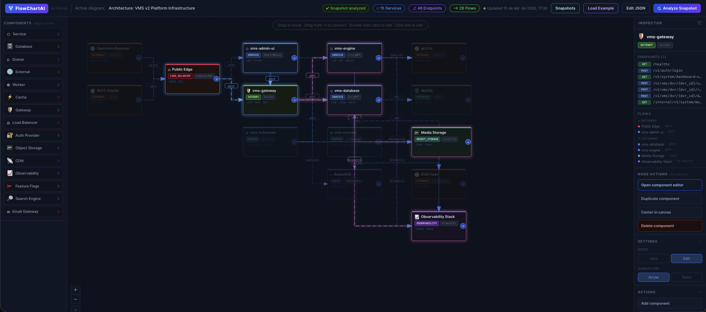
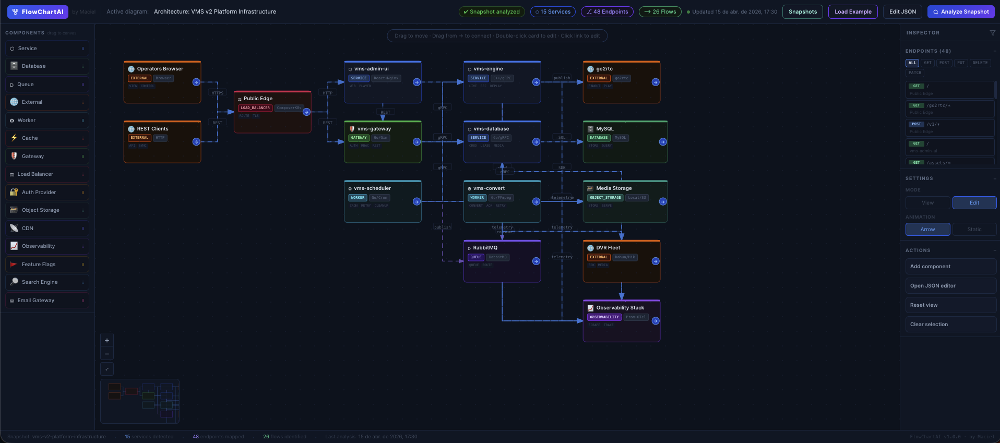
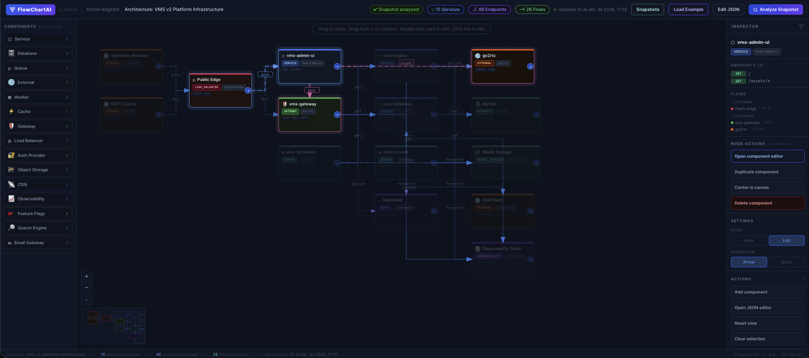

# flow diagram AI Skill

Public repository for the `flow-diagram-ai` skill for Codex.

Portuguese version: [README-PT-BR.md](./README-PT-BR.md)

This skill was created to turn architecture descriptions, project analysis, or partial JSON into a valid snapshot for the FlowChartAI dashboard. The output can be:

- only the final diagram JSON;
- or a frontend project already materialized with a dashboard ready to open and edit.

## What this skill solves

The core problem here is not only drawing boxes and arrows. The goal is to produce a consistent contract between:

- architecture components;
- connections between those components;
- endpoints exposed by each element;
- metadata and analysis statistics;
- visual layout importable in the editor.

This skill centralizes that flow and prevents each diagram generation from inventing a different format.

## How the dashboard works

The dashboard is a visual editor driven by a snapshot JSON. It does not depend on a backend for the main flow and works as a workspace to build, review, and export architecture diagrams.

### Interface structure

The dashboard is split into four main areas:

1. `Top bar`
   Shows snapshot status, totals for services, endpoints, and flows, plus the main actions:
   - `Snapshots`
   - `Load Example`
   - `Edit JSON`
   - `Analyze Snapshot`

2. `Left sidebar`
   Works as a component palette. Types can be dragged onto the canvas:
   - `Service`
   - `Database`
   - `Queue`
   - `External`
   - `Worker`
   - `Cache`
   - `Gateway`
   - `Load Balancer`
   - `Auth Provider`
   - `Object Storage`
   - `CDN`
   - `Observability`
   - `Feature Flags`
   - `Search Engine`
   - `Email Gateway`

3. `Central canvas`
   This is the diagram itself. You can:
   - move components;
   - drag new components onto the canvas;
   - create connections by dragging the arrow from a card;
   - select connections with a single click;
   - edit a component with double-click;
   - edit a connection by clicking on the line;
   - manually reposition a connection route through the center handle;
   - navigate with zoom, pan, and mini-map.

4. `Inspector`
   Context panel on the right. It changes according to the current selection:
   - when a component is selected, it shows endpoints, related flows, and node actions;
   - when nothing is selected, it works as an overview of endpoints and settings;
   - when a connection is selected, it opens connection editing;
   - it also concentrates mode and animation settings.

## How the diagram works

The diagram is persisted as a snapshot JSON with a fixed contract. In practice, it is composed of these blocks:

- `meta`
  Snapshot identity, name, description, timestamps, and status.

- `diagrams`
  List of available diagrams. In practice, the current flow works with one main diagram.

- `layout.nodes`
  Visual components on the canvas.

- `layout.connections`
  Directional links between components.

- `endpointsByNode`
  Endpoints associated with each component.

- `analysis`
  Analysis source, last execution timestamp, and aggregated statistics.

### Editor mental model

The dashboard treats the diagram as a combination of:

- architecture semantics;
- visual structure;
- operational inspection.

Each card is not just a visual block. It represents a system element with:

- type;
- technology;
- summarized operations;
- associated endpoints;
- incoming and outgoing relationships.

Each connection is also not just a line. It represents a directed flow between components, with:

- source and target;
- short label;
- synchronous or asynchronous behavior;
- automatic or manual routing.

### Visual behavior of connections

When a component is selected:

- `incoming` flows are highlighted in one color;
- `outgoing` flows are highlighted in another color;
- related cards stay emphasized;
- unrelated elements have reduced opacity.

This lets you read component context without losing sight of the whole system.

### Manual line routing

Connections use orthogonal routing by default. When needed, the line can be manually adjusted:

- select the connection;
- click and hold the center handle;
- drag to reposition the main segment;
- the value is then saved in `routing`;
- `Reset route` returns the connection to automatic mode.

This detail matters because the editor does not only generate valid JSON; it also preserves layout readability decisions.

## Skill usage modes

### 1. JSON-only

Use when you only want the final snapshot.

Example:

```text
Use flow-diagram-ai to generate a diagram snapshot for a microservices e-commerce platform.
```

### 2. Ready-project

Use when you want a project ready to open locally.

Example:

```text
Use flow-diagram-ai to generate an infrastructure diagram for the entire project in a folder named flow-diagram.
```

In this mode, the skill should:

- generate the snapshot JSON;
- copy the dashboard starter;
- write the snapshot to the default path consumed by the interface;
- optionally install dependencies and validate the build.

### 3. Repair / Normalize

Use when a JSON already exists and you want to fix or expand it without breaking the contract.

Example:

```text
Use flow-diagram-ai to fix this invalid snapshot and keep the same architecture.
```

## Repository structure

```text
.
├── assets/                              # images used in the README
├── skills/
│   └── flow-diagram-ai/
│       ├── SKILL.md
│       ├── agents/
│       ├── assets/
│       ├── examples/
│       ├── references/
│       ├── scripts/
│       └── starter/dashboard-frontend/
├── README.md
└── README-PT-BR.md
```

## Installation

Copy the skill to the Codex skills folder:

```bash
mkdir -p ~/.codex/skills
cp -R skills/flow-diagram-ai ~/.codex/skills/flow-diagram-ai
```

After that, the skill can be called by the identifier `flow-diagram-ai`.

## Main skill contents

Inside [skills/flow-diagram-ai](/Users/macielcr7/Desktop/dev/maciel/Flow-Chart-AI/skills/flow-diagram-ai):

- [SKILL.md](/Users/macielcr7/Desktop/dev/maciel/Flow-Chart-AI/skills/flow-diagram-ai/SKILL.md)
  Execution rules, usage modes, and main flow.

- [references/snapshot-spec.md](/Users/macielcr7/Desktop/dev/maciel/Flow-Chart-AI/skills/flow-diagram-ai/references/snapshot-spec.md)
  Formal snapshot JSON contract.

- [references/import-checklist.md](/Users/macielcr7/Desktop/dev/maciel/Flow-Chart-AI/skills/flow-diagram-ai/references/import-checklist.md)
  Checklist to avoid import failures.

- [examples](/Users/macielcr7/Desktop/dev/maciel/Flow-Chart-AI/skills/flow-diagram-ai/examples)
  Library of valid snapshots for real-world scenarios.

- [scripts/validate_snapshot.py](/Users/macielcr7/Desktop/dev/maciel/Flow-Chart-AI/skills/flow-diagram-ai/scripts/validate_snapshot.py)
  JSON contract validator.

- [scripts/materialize_starter.py](/Users/macielcr7/Desktop/dev/maciel/Flow-Chart-AI/skills/flow-diagram-ai/scripts/materialize_starter.py)
  Script that materializes the frontend project with the injected snapshot.

- [starter/dashboard-frontend](/Users/macielcr7/Desktop/dev/maciel/Flow-Chart-AI/skills/flow-diagram-ai/starter/dashboard-frontend)
  Dashboard starter, ready for local use.

## Validation

Full smoke test:

```bash
python3 skills/flow-diagram-ai/scripts/smoke_test.py
```

Validation for a specific snapshot:

```bash
python3 skills/flow-diagram-ai/scripts/validate_snapshot.py path/to/file.json
```

## Reading the visual examples

### Example 1: operational view of a selected gateway



This image shows the dashboard's operational reading clearly:

- on the left, the component palette available to drag onto the canvas;
- in the center, a distributed system with multiple services, database, storage, queue, and observability;
- on the right, the inspector focused on `vms-gateway`.

The most important point here is that the side panel does not only show card data. It exposes:

- endpoints for the selected component;
- incoming and outgoing flows;
- quick actions such as edit, duplicate, center, and remove.

This is the closest view to "node inspection".

### Example 2: system-wide view of the full diagram



In this image, the focus is less on a specific component and more on the system as a whole:

- the canvas shows the full topology;
- the mini-map helps navigate larger diagrams;
- the inspector acts as an endpoint catalog;
- the top bar summarizes snapshot status and the analyzed system volume.

This is the best image to understand that the editor is not a loose canvas. It also works as an architecture reading console.

### Example 3: contextual relationship reading



This image highlights the contextual selection behavior:

- one component is in focus;
- related flows are highlighted;
- elements with no visual link to the selection are dimmed;
- the inspector follows the active node and shows its relationships.

This behavior greatly improves reading medium and large graphs because it reduces visual noise without hiding the rest of the architecture.

## Summary

This skill exists to close a complete flow:

1. understand an architecture;
2. turn it into a consistent snapshot;
3. validate the contract;
4. open this output in a usable visual dashboard;
5. continue editing on the canvas or in raw JSON.

The real value is not only "generating a JSON", but keeping JSON, editor, and starter working as one single tool.
